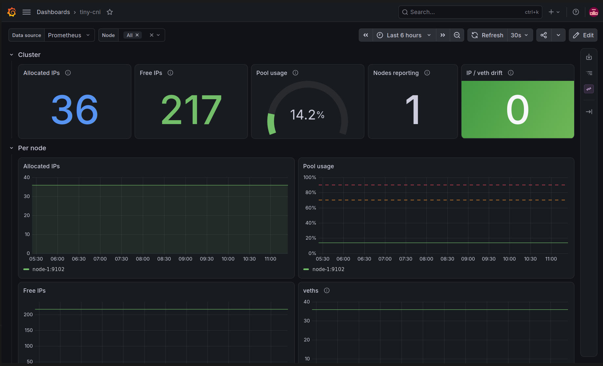

# tiny-cni

A minimal bridge-based CNI plugin conforming to the [official CNI spec](https://www.cni.dev/docs/spec), with a built-in IPAM, NAT egress to the internet, a Kubernetes DaemonSet install and Prometheus metrics.


## Features

- **Pod-to-pod** networking over a Linux bridge, on a single node.
- **Pod-to-internet** through a gateway on the bridge and an iptables `MASQUERADE` rule.
- **Built-in IPAM**: file-backed and `flock`-protected. Freed IPs are reused.
- **Kubernetes install**: a DaemonSet drops the binary and the config onto every node.
- **Metrics**: a sidecar agent exposes IPAM/veth gauges to Prometheus, and a Grafana dashboard is included.
- **Conformance**: an implementation-agnostic e2e suite checks the plugin against the CNI spec.

## Running live

tiny-cni is the only CNI of a live single-node Kubernetes cluster. The screenshot shows 36 pods with their IPs allocated by tiny-cni and zero drift between allocated IPs and veths:



## Quickstart

### On Kubernetes

```bash
kubectl apply -f manifests/daemonset.yaml
```

The DaemonSet runs in `kube-system` on every node, including nodes that are still `NotReady`:

- the `install` init container copies `tiny-cni` to `/opt/cni/bin` and [`docker/config-default.json`](docker/config-default.json) to `/etc/cni/net.d/05-tinycni.conf`;
- the `agent` container stays up and serves metrics on `:9102` (see [Metrics](#metrics)).

Images are published to `ghcr.io/corentin-dupaigne/tiny-cni` and `ghcr.io/corentin-dupaigne/tiny-cni-agent` on each semver tag.

> [!NOTE]
> Every node gets the same `10.244.0.0/24` subnet, so tiny-cni only supports single-node clusters for now (see [Roadmap](#roadmap)).
> The `ipam-state` hostPath in the manifest must match `ipam.storagePath` in the config.

### Locally, by hand

```bash
make build                     # builds bin/tiny-cni and bin/tiny-cni-agent

sudo ip netns add container2

sudo CNI_COMMAND=ADD \
  CNI_CONTAINERID=container2 \
  CNI_IFNAME=eth0 \
  CNI_NETNS=/var/run/netns/container2 \
  CNI_PATH=./bin \
  ./bin/tiny-cni < docker/config-default.json

sudo ip netns exec container2 ping -c1 1.1.1.1   # pod-to-internet

sudo CNI_COMMAND=DEL \
  CNI_CONTAINERID=container2 \
  CNI_IFNAME=eth0 \
  CNI_NETNS=/var/run/netns/container2 \
  CNI_PATH=./bin \
  ./bin/tiny-cni < docker/config-default.json
```

The config format, env vars and JSON results are documented in [docs/cni-io.md](docs/cni-io.md).

## How it works

| Command | Status          | Mandatory |
| ------- | --------------- | --------- |
| ADD     | implemented     | yes       |
| DEL     | implemented     | yes       |
| VERSION | implemented     | yes       |
| CHECK   | not implemented | no        |
| GC      | not implemented | no        |
| STATUS  | not implemented | no        |

### ADD

ADD plugs an existing container netns into the node network. It does not create the container. If a step fails, ADD deletes whatever it already created.

1. **Host setup (idempotent):** turns on `net.ipv4.ip_forward` and adds three iptables rules for the subnet: `MASQUERADE` for traffic leaving the subnet, and `FORWARD ACCEPT` for traffic from and to the pods. Some hosts (Docker, for example) set the `FORWARD` policy to `DROP`.
2. **Bridge:** reuses the bridge named by `bridge` in the config, or creates it for the first container. The bridge gets the gateway IP (`.1` of the subnet).
3. **veth pair:** the host end is named `<prefix>-<8 hex chars>`, enslaved to the bridge and put in hairpin mode. The other end is moved into `CNI_NETNS` and renamed `CNI_IFNAME`.
4. **IP:** allocates an address from the [IPAM](docs/ipam.md) and assigns it to the container end.
5. **Container netns:** brings up `CNI_IFNAME` and `lo`, then adds a default route via the gateway.


### DEL

DEL is idempotent: a missing netns or interface is not an error.

1. Switches to the container netns (`CNI_NETNS`).
2. Deletes the container's veth end (`CNI_IFNAME`). The kernel removes the host end with it.
3. Releases the container's IP in the IPAM.


## Metrics

`tiny-cni-agent` runs next to the plugin on each node and serves Prometheus metrics on `:9102/metrics`:

| Metric                  | Meaning                                    |
| ----------------------- | ------------------------------------------ |
| `tinycni_capacity_ips`  | Usable IPs in the subnet                   |
| `tinycni_allocated_ips` | IPs currently allocated to containers      |
| `tinycni_left_ips`      | IPs still free                             |
| `tinycni_veths`         | Host-side veths with the configured prefix |

A Grafana dashboard ships in [`monitoring/grafana/`](monitoring/grafana/grafana-dashboard.json) (see the [screenshot above](#running-live)). Scrape setup and dashboard details are in [docs/observability.md](docs/observability.md).

## Development

```bash
make build      # bin/tiny-cni + bin/tiny-cni-agent
make test       # unit tests, with -race
make test-e2e   # build, then run the CNI conformance suite (namespace specs need root)
```

The [`e2e/`](e2e) suite drives the built binary like a runtime would: env vars and stdin config go in, and it checks stdout, the exit code and the resulting netns. It does not depend on tiny-cni's internals, so it can run against any CNI plugin binary.

CI blocks merges to `main` unless `gofmt`, `go vet`, `go build`, `go test -race` and `golangci-lint` all pass. Pushing a semver tag makes goreleaser publish the binaries and images.

## Documentation

- [CNI I/O contract](docs/cni-io.md): env vars, network config, results and errors
- [IPAM](docs/ipam.md): allocation, state file, locking
- [Observability](docs/observability.md): metrics agent, Prometheus, Grafana
- [Architecture decision records](docs/adr/)

## Roadmap

- Add VXLAN and per-node subnets so pods can talk across nodes (single node only for now).
- Add the CHECK CNI command.
