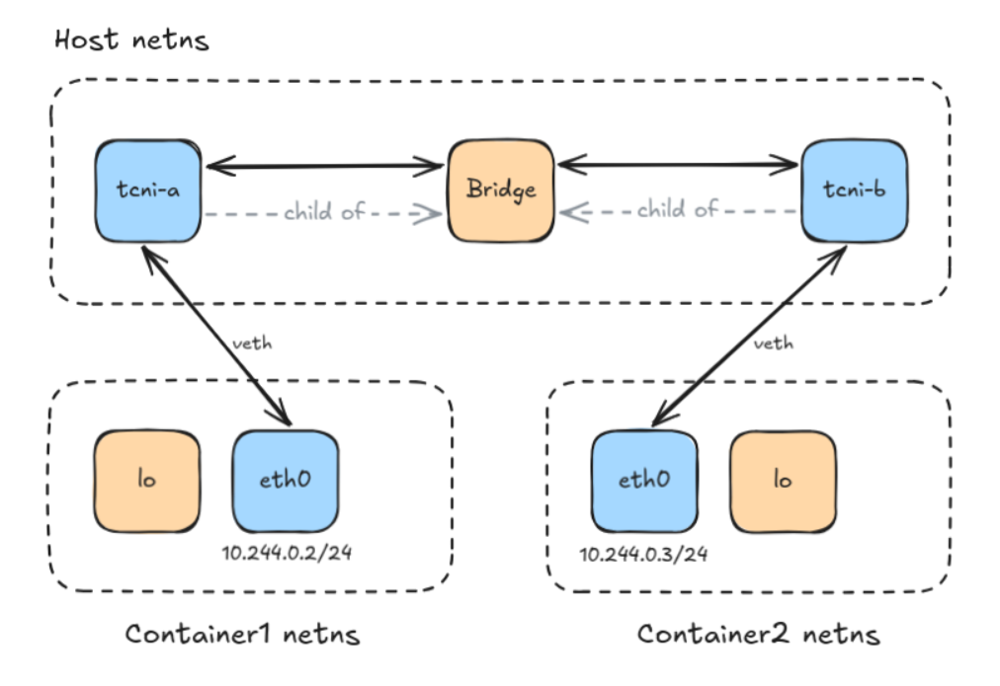
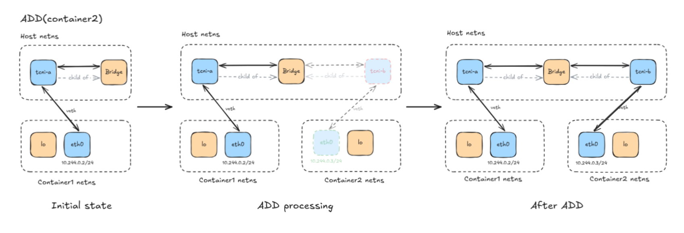
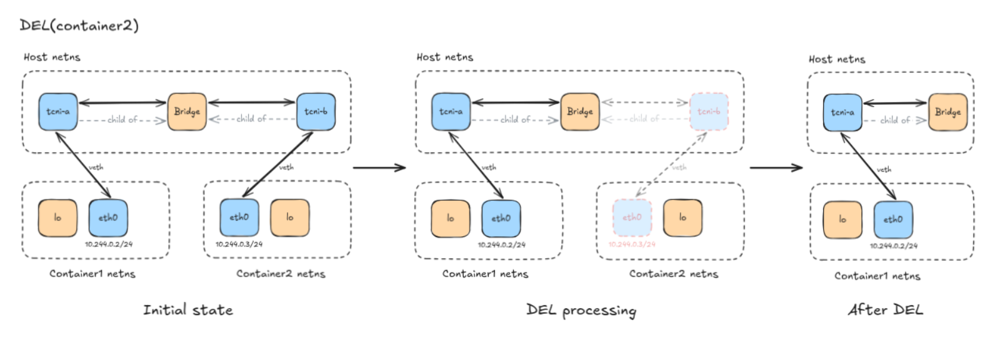

# tiny-cni

A minimal bridge-based CNI plugin conforming to the [official CNI spec](https://www.cni.dev/docs/spec), with a built-in IPAM.



## Commands

| Command | Status          | Mandatory |
| ------- | --------------- | --------- |
| ADD     | implemented     | yes       |
| DEL     | implemented     | yes       |
| VERSION | implemented     | yes       |
| CHECK   | not implemented | no        |
| GC      | not implemented | no        |
| STATUS  | not implemented | no        |

### ADD

```bash
make build

sudo ip netns add container2

CNI_COMMAND=ADD \
CNI_CONTAINERID=container2 \
CNI_IFNAME=eth0 \
CNI_NETNS=/var/run/netns/container2 \
CNI_PATH=./bin/tiny-cni \
  ./bin/tiny-cni < config.json
```

The purpose of ADD is to plug a container into the cluster network, but it does not create any container — that's the runtime's job. On error, it deletes what had already been created.

1. Reuses or creates (first container) a Linux bridge on the host named by the value of the `bridge` key in the config.
2. Creates a veth pair: one end (host side) is named `<prefix>-<8 hex chars>` and is enslaved to the bridge, the other end is moved into the container netns (`CNI_NETNS`) and named `CNI_IFNAME`.
3. Allocates an IP from the built-in IPAM and assigns it to the container veth end.



### DEL

```bash
CNI_COMMAND=DEL CNI_CONTAINERID=container2 \
CNI_IFNAME=eth0 \
CNI_NETNS=/var/run/netns/container2 \
CNI_PATH=./bin/tiny-cni \
  ./bin/tiny-cni < config.json
```

DEL deletes the interface defined by `CNI_IFNAME` inside the container at `CNI_NETNS` and deallocates the veth side IP using the IPAM module. DEL is idempotent: a missing netns or interface does not return any error.

1. Switch to the container namespace (`CNI_NETNS`).
2. Find the veth container's side interface (`CNI_IFNAME`) and delete it.
3. Deallocate the container's IP.



## I/O

Per the CNI spec, the runtime and the plugin only ever talk through env vars, stdin, stdout, stderr and the exit code, nothing else is shared between them.

**In:** `CNI_COMMAND` (`ADD`/`DEL`/`VERSION`), `CNI_CONTAINERID`, `CNI_NETNS`, `CNI_IFNAME` and `CNI_PATH` come in as env vars (`CNI_ARGS` is accepted but ignored). The network configuration comes in as JSON on stdin:

```json
{
  "cniVersion": "1.0.0",
  "name": "tinynet",
  "type": "tiny-cni",
  "bridge": "tcni-bridge",
  "prefix": "tcni",
  "ipam": {
    "type": "tiny-cni",
    "subnet": "10.244.0.0/24",
    "storagePath": "/tmp/tinycni-counter"
  }
}
```

`cniVersion`, `name` and `type` are the standard CNI fields; `bridge` and `prefix` drive the bridge/veth naming described above, and `ipam.subnet`/`ipam.storagePath` configure the allocator below.

**Out:** on success, stdout carries the CNI `Result` as JSON, in the schema of the request's `cniVersion`; on failure, stdout carries a CNI error object as JSON (`{"code", "msg", "details"}`) instead. Either way the exit code follows: `0` on success, `1` on error. stderr only ever carries structured JSON logs (`slog`) for debugging.

ADD's result lists both ends of the veth pair (host side with no `sandbox`, container side with `sandbox` set to `CNI_NETNS`) and the IP handed out by the IPAM, pointing at the container interface by index:

```json
{
  "cniVersion": "1.0.0",
  "interfaces": [
    { "name": "tcni-a1b2c3d4", "mac": "aa:bb:cc:dd:ee:01" },
    { "name": "eth0", "mac": "aa:bb:cc:dd:ee:02", "sandbox": "/var/run/netns/container2" }
  ],
  "ips": [
    { "interface": 1, "address": "10.244.0.2/24" }
  ]
}
```

DEL has no stdout output on success (empty result). Any error, from either command, is reported as json error, as required by the CNI spec.

## IPAM

IPAM is part of the CNI plugin and therefore lives in the same binary. It is stateful: it uses a storage path given through the config to read and update the current IPAM state. The state contains two maps, one holding each container and its associated IP, and one tracking each allocated IP. Every IPAM operation that modifies the state uses a `flock` syscall on the file to avoid race conditions.

The network and gateway addresses (`.0` and `.1` of the subnet) are reserved up front. The first container gets `.2`.

IPAM state example:

```json
{
  "containerToIp": {
    "container1": "10.244.0.2",
    "container2": "10.244.0.3"
  },
  "allocatedSet": {
    "10.244.0.0": true,
    "10.244.0.1": true,
    "10.244.0.2": true,
    "10.244.0.3": true
  }
}
```

## E2E

The CNI conformance requirements ([spec](https://www.cni.dev/docs/spec/)) are exercised by a separate, self-contained test suite in [`e2e/`](/e2e), built on Ginkgo/Gomega. It execs the built `tiny-cni` binary like a runtime would: env vars in, stdin config in, stdout/exit code checked out and inspects the resulting network namespace, so it is agnostic to tiny-cni's internals and could run against any CNI plugin binary.

```bash
make test-e2e   # build + run the full suite against tiny-cni
```

Namespace-touching specs need root and are skipped otherwise.

## Decisions

Architecture decision records live in [docs/adr/](/docs/adr).

## Roadmap

- Add a gateway and routes so pods can reach the web (for now, pod to pod only).
- Add VXLAN so pods can communicate across nodes (for now, single node only).
- Add the CHECK CNI function.
